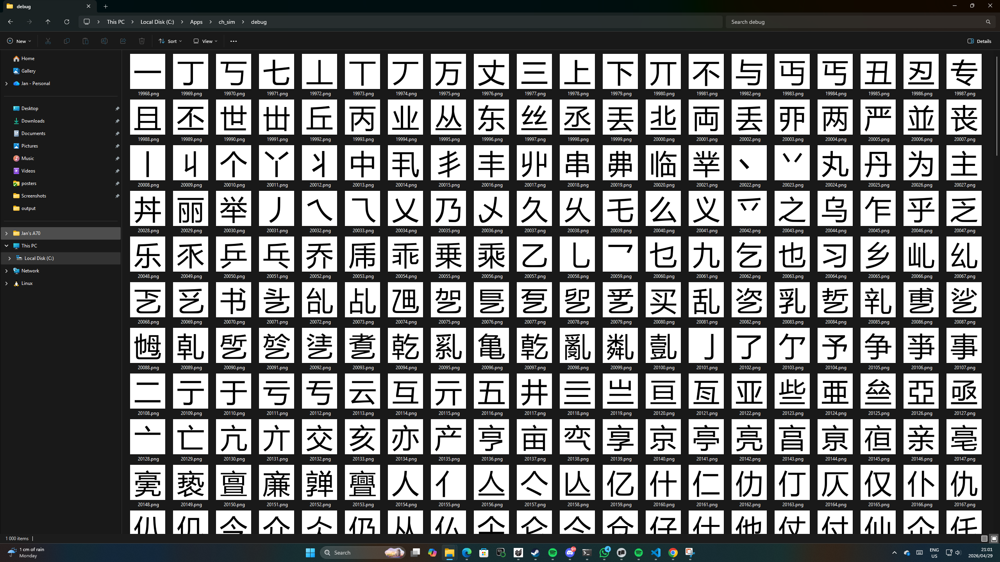

# Chinese Character Symmetry Analyser

A Node.js program that detects Chinese characters with **left-right (vertical axis) symmetry** using visual analysis with canvas rendering.

## Overview

This program:

- **Renders** Chinese characters using Microsoft YaHei font
- **Analyses pixels** to detect perfect left-right symmetry
- **Categorises** results into perfectly symmetrical, near-symmetrical, and asymmetrical
- **Exports** detailed results to JSON format

### Install dependencies:

```bash
npm install
```

### Analyse the first 1000 characters:

```bash
node server.js 1000
```

**Look at `results1000.md` for detailed results of the first 1000 characters!**

Analysis complete in about 3.86 seconds

```

======================================================================
RESULTS
======================================================================

PERFECTLY SYMMETRICAL (14 characters of 1000 tested):
----------------------------------------------------------------------
  1. 一 (99.90% match) (U+4E00, 19968)
  2. 丄 (100.0% match) (U+4E04, 19972)
  3. 丅 (100.0% match) (U+4E05, 19973)
  4. 三 (99.80% match) (U+4E09, 19977)
  5. 且 (99.61% match) (U+4E14, 19988)
  6. 丨 (99.43% match) (U+4E28, 20008)
  7. 丰 (99.96% match) (U+4E30, 20016)
  8. 串 (99.59% match) (U+4E32, 20018)
  9. 二 (99.90% match) (U+4E8C, 20108)
 10. 亖 (99.81% match) (U+4E96, 20118)
 11. 亘 (99.40% match) (U+4E98, 20120)
 12. 冖 (100.0% match) (U+5196, 20886)
 13. 冝 (99.92% match) (U+519D, 20893)
 14. 冨 (99.33% match) (U+51A8, 20904)

NEAR SYMMETRICAL (23 characters of 1000 tested):
----------------------------------------------------------------------
  1. 丗 (98.61% match) (U+4E17, 19991)
  2. 个 (98.58% match) (U+4E2A, 20010)
  3. 丫 (98.49% match) (U+4E2B, 20011)
  4. 中 (99.08% match) (U+4E2D, 20013)
  5. 丷 (98.63% match) (U+4E37, 20023)
  6. 主 (99.11% match) (U+4E3B, 20027)
  7. 亗 (98.83% match) (U+4E97, 20119)
  8. 亜 (98.86% match) (U+4E9C, 20124)
  9. 亞 (98.95% match) (U+4E9E, 20126)

Look at `results1000.md` for detailed results of the first 1000 characters.

```


